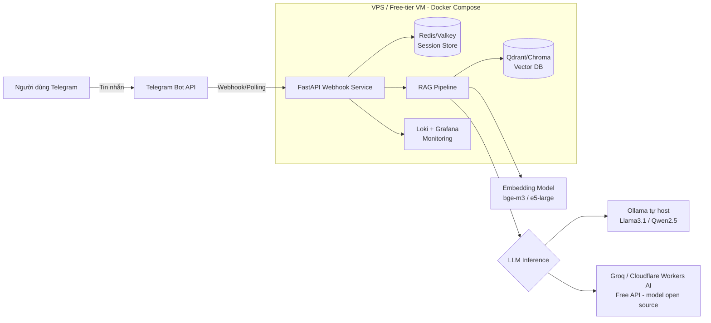

# Thiết kế Chatbot Tư vấn Matcha (Telegram Bot) — Phiên bản 100% Free & Open Source

> Mục tiêu: thay thế toàn bộ các dịch vụ trả phí (AWS Bedrock, ECR, ECS/EC2...) bằng công cụ/mã nguồn mở, tự host được, chi phí gần như bằng 0 (chỉ tốn tiền VPS nếu không dùng free-tier). Kênh chat chuyển từ Zalo OA sang **Telegram Bot API** (miễn phí hoàn toàn, không giới hạn tier).

---

## 1. Bảng thay thế: Trả phí → Open Source

| Thành phần | Bản gốc (trả phí) | Thay thế Open Source | Ghi chú |
|---|---|---|---|
| Kênh chat | Zalo OA API | **Telegram Bot API** (`python-telegram-bot` / `aiogram`) | Miễn phí 100%, setup 5 phút qua BotFather, không cần duyệt doanh nghiệp |
| LLM suy luận (chạy local) | AWS Bedrock (Claude/Titan...) | **Ollama** + model mã nguồn mở (Llama 3.1 8B, Qwen2.5 7B, Vistral-7B/VinaLLaMA cho tiếng Việt) | Cần máy có RAM ≥16GB hoặc GPU để chạy mượt; máy yếu sẽ rất chậm |
| LLM suy luận (cloud, free tier) | AWS Bedrock | **Groq Cloud API** / **Cloudflare Workers AI** / **HuggingFace Inference API** (xem mục 1b) | Vẫn gọi model mã nguồn mở (Llama, Mixtral, Gemma) nhưng chạy trên hạ tầng free của bên thứ 3 — không cần máy mạnh |
| Serving LLM tốc độ cao (tự host) | — | **vLLM** hoặc **llama.cpp / text-generation-webui** | Dùng khi cần throughput cao hơn Ollama và có GPU riêng |
| Vector Database (RAG) | Pinecone / AWS Kendra | **Qdrant** hoặc **Chroma** (self-host, Docker) | Cả hai open source, có Docker image chính thức |
| Embedding model | Bedrock Embeddings | **BAAI/bge-m3** hoặc **intfloat/multilingual-e5-large** (chạy qua `sentence-transformers`) | Hỗ trợ tiếng Việt tốt, chạy local |
| Backend webhook | — | **FastAPI** (Python) hoặc **Express.js** (Node.js) | Đã open source sẵn |
| Session/context store | — | **Redis** (self-host) | Open source, BSD/RSAL tùy version — dùng bản Redis OSS (7.x trước Redis Labs license change) hoặc **Valkey** (fork open source chính thức) |
| Container registry | AWS ECR | **Docker Hub free tier** (public repo miễn phí) hoặc self-host **Harbor** | Harbor = 100% open source, tự quản lý |
| CI/CD | — | **GitHub Actions** (free cho repo, có free minutes) hoặc tự host **Gitea + Woodpecker CI / Drone CI** | Gitea + Woodpecker = full open source stack nếu muốn tránh phụ thuộc GitHub |
| Hosting/Deploy | AWS ECS/EC2 | **Docker Compose** trên VPS, hoặc **Oracle Cloud Free Tier** (VM luôn miễn phí) / server nhà có sẵn | Phần mềm deploy: 100% OSS (Docker, Compose); phần hạ tầng máy chủ vẫn cần 1 máy chạy (VPS free-tier hoặc máy vật lý) |
| Reverse proxy / TLS | — | **Caddy** hoặc **Nginx** + **Let's Encrypt** (Certbot) | Miễn phí, tự động cấp SSL |
| Monitoring | CloudWatch | **Prometheus + Grafana** | Toàn bộ open source |
| Log aggregation | CloudWatch Logs | **Loki** (Grafana Labs) hoặc ghi log ra file + **Vector.dev** | Open source |
| Orchestration (nếu scale) | — | **Docker Swarm** (đơn giản) hoặc **K3s** (Kubernetes nhẹ, open source) | Chỉ cần khi traffic lớn, ban đầu không bắt buộc |

**Lưu ý về Telegram Bot API**: đây là dịch vụ của Telegram (bên thứ 3, không open source) nhưng **hoàn toàn miễn phí 100%**, không giới hạn tier, không cần duyệt hồ sơ doanh nghiệp như Zalo OA. Tạo bot qua `@BotFather`, nhận token, dùng thư viện open source `python-telegram-bot` hoặc `aiogram` để code webhook/polling.

---

## 1b. Không đủ máy mạnh? Dùng Cloud API free cho model open source

Nếu máy/VPS không đủ RAM/GPU để chạy Ollama mượt, có thể **giữ nguyên model mã nguồn mở** nhưng để bên thứ 3 lo phần compute, gọi qua API (miễn phí trong hạn mức):

| Nhà cung cấp | Model open source hỗ trợ | Free tier | Ghi chú |
|---|---|---|---|
| **Groq Cloud** (`console.groq.com`) | Llama 3.1/3.3, Mixtral, Gemma2, Qwen | Free tier khá rộng rãi (giới hạn request/phút), không cần thẻ tín dụng | Tốc độ suy luận rất nhanh (LPU), phù hợp chatbot realtime |
| **Cloudflare Workers AI** | Llama 3, Mistral, Gemma | 10.000 "neurons"/ngày miễn phí | Tích hợp tốt nếu backend cũng deploy trên Cloudflare |
| **Hugging Face Inference API** | Hầu hết model open source trên HF Hub | Free tier có giới hạn rate, phù hợp dev/test | Có thể bị cold-start chậm với model ít dùng |
| **OpenRouter** | Nhiều model, có mục lọc "free" | Một số model gắn nhãn `:free` dùng miễn phí, giới hạn request/ngày | Tiện để so sánh nhiều model qua 1 API key |
| **Google AI Studio (Gemini)** | Không phải open source (chỉ để tham khảo) | Free tier hào phóng | Chỉ dùng nếu chấp nhận model closed-source |

**Khuyến nghị**: dùng **Groq** làm lựa chọn chính (free, nhanh, model open source), viết code theo chuẩn OpenAI-compatible API để sau này có thể chuyển sang Ollama tự host mà không cần sửa nhiều code (dùng thư viện `openai` Python trỏ `base_url` sang Groq hoặc Ollama).

## 2. Kiến trúc tổng thể

---

## 3. CI/CD Pipeline (Full Open Source)

1. **Source control**: Gitea (self-host, giống GitHub UI) hoặc GitHub free tier.
2. **CI**: Woodpecker CI / Drone CI (self-host) hoặc GitHub Actions.
   - Chạy lint + unit test (`pytest`).
   - Chạy bộ **eval prompt tự động**: tập câu hỏi mẫu → so sánh output với rule-based checks (không cần dịch vụ trả phí).
   - Build Docker image.
3. **Registry**: đẩy image lên Docker Hub (public, free) hoặc Harbor self-host.
4. **CD**: Woodpecker/Drone gọi script SSH vào VPS → `docker compose pull && docker compose up -d` (zero-downtime nếu dùng Caddy làm reverse proxy + health check).
5. **Rollback**: giữ tag image theo version (`vX.Y.Z`), rollback bằng cách đổi tag trong `docker-compose.yml` rồi redeploy.

---

## 4. Phân công team (cập nhật theo stack mới)

| Vị trí | Trách nhiệm |
|---|---|
| Backend & Telegram Integrator | FastAPI webhook/polling, xác thực bot token, quản lý session qua Redis/Valkey |
| AI/Prompt Engineer | Thiết kế prompt, cấu hình Groq/Ollama (tùy năng lực máy), chọn model phù hợp tiếng Việt |
| Data/Knowledge Engineer | Thu thập dữ liệu Matcha, chunk + embed bằng bge-m3, nạp vào Qdrant/Chroma |
| MLOps/DevOps Engineer | Viết Dockerfile, Docker Compose, cấu hình Woodpecker/GitHub Actions, Caddy TLS, Prometheus/Grafana |
| QA & PM | Viết bộ test case (eval set), quản lý tiến độ Gitea Issues/Trello free tier |

---

## 5. Chi phí thực tế còn lại

- **0đ**: toàn bộ phần mềm (Ollama, Qdrant, Redis, FastAPI, Docker, Grafana, Woodpecker...).
- **Có thể 0đ**: VPS nếu dùng Oracle Cloud Always Free Tier (4 vCPU ARM + 24GB RAM free vĩnh viễn) hoặc máy vật lý sẵn có.
- **Có thể 0đ**: LLM inference qua Groq/Cloudflare Workers AI free tier nếu máy không đủ mạnh chạy Ollama local.
- **Domain**: nếu cần tên miền riêng cho webhook (~vài trăm nghìn/năm) — có thể dùng DuckDNS/No-IP free nếu chấp nhận subdomain miễn phí (Telegram webhook cũng yêu cầu HTTPS hợp lệ).
- **Telegram Bot**: miễn phí hoàn toàn, không giới hạn tin nhắn/tháng.
